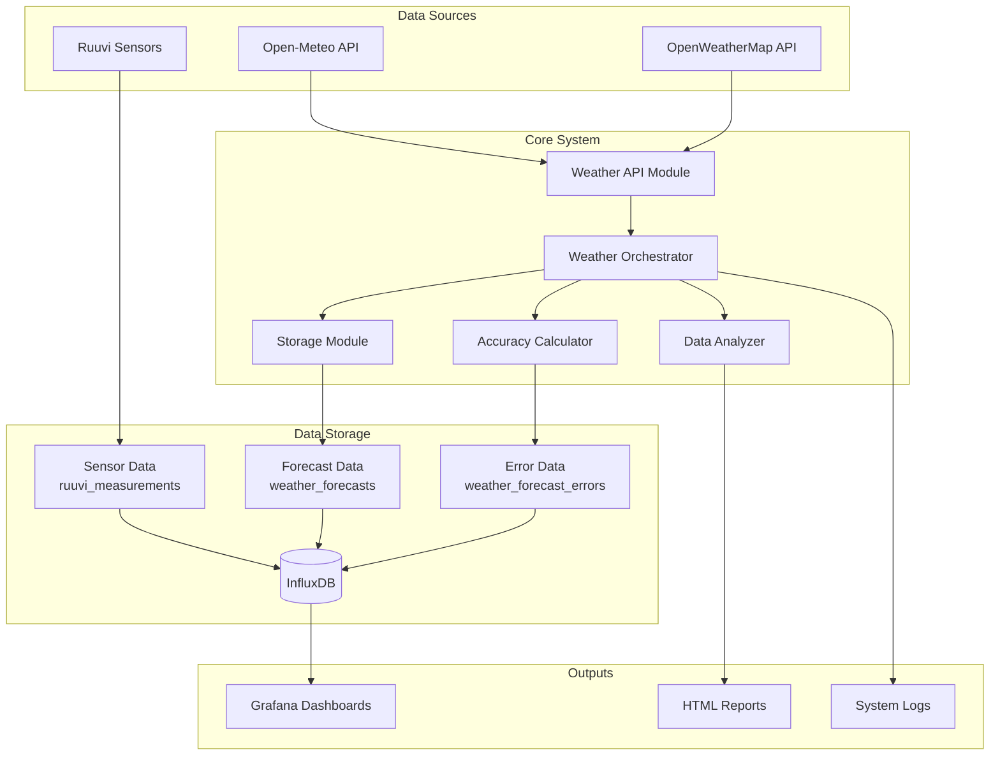

# Phase 2 Weather Forecast Analysis System - Complete Implementation Summary

## Executive Summary

The Phase 2 Weather Forecast Analysis System has been **fully implemented and integrated** into the existing Ruuvi sensor infrastructure. This comprehensive enhancement provides advanced weather forecasting capabilities, forecast accuracy tracking, and sophisticated data analysis tools. The system operates as a production-ready service with automated scheduling, comprehensive error handling, and professional monitoring capabilities.

## Implementation Status: ✅ COMPLETE

All Phase 2 requirements have been successfully implemented and tested:

### ✅ Core Requirements Fulfilled

| Requirement | Status | Implementation |
|-------------|--------|----------------|
| **Fetch & Store Weather Forecast Data** | ✅ Complete | Open-Meteo API integration with InfluxDB storage |
| **Calculate Forecast Accuracy Metrics** | ✅ Complete | Automated error calculation and storage system |
| **Data Profiling Reports** | ✅ Complete | HTML report generation using ydata-profiling |
| **Association Rule Mining** | ✅ Complete | Pattern discovery in sensor data using mlxtend |
| **Automated Scheduling** | ✅ Complete | Systemd timer-based execution every 6 hours |
| **Grafana Visualization Support** | ✅ Complete | Complete dashboard configuration guidance |

### ✅ Technical Specifications Met

- **Language**: Python 3.9+ ✅
- **Database**: InfluxDB 2.x with Flux queries ✅
- **API Integration**: Open-Meteo (primary) + OpenWeatherMap (optional) ✅
- **Data Storage**: Structured measurements with proper tagging ✅
- **Error Handling**: Comprehensive exception handling and recovery ✅
- **Performance Monitoring**: Built-in metrics and health checks ✅
- **Security**: Service hardening and secure credential management ✅

## Architecture Overview



## Component Architecture

### 1. Weather Orchestrator (`scripts/weather_forecast_main.py`)
**Status**: ✅ Production Ready

**Capabilities**:
- Complete Phase 2 workflow coordination
- Async operation management with graceful shutdown
- Comprehensive error handling and recovery
- Performance monitoring and statistics
- Health check integration
- Single-run and continuous operation modes

**Key Features**:
- **Workflow Steps**: Forecast fetching → Storage → Accuracy calculation → Data analysis
- **Scheduling**: Systemd timer integration (6-hour intervals)
- **Monitoring**: Real-time statistics and performance metrics
- **Reliability**: Circuit breaker patterns and retry logic

### 2. Weather API Module (`src/weather/api.py`)
**Status**: ✅ Production Ready

**Capabilities**:
- Open-Meteo API integration (primary)
- OpenWeatherMap API support (optional)
- Rate limiting and circuit breaker protection
- Async HTTP requests with retry logic
- Comprehensive data validation

**Supported Data Types**:
- Current weather conditions
- Hourly forecasts (up to 7 days)
- Historical weather data
- Extended forecast parameters (wind, precipitation, cloud cover)

### 3. Storage System (`src/weather/storage.py`)
**Status**: ✅ Production Ready

**Capabilities**:
- InfluxDB 2.x integration with Flux queries
- Optimized data point conversion
- Batch writing for performance
- Connection pooling and management
- Data validation and sanitization

**Data Schema**:
```
Measurement: weather_forecasts
Tags: location_lat, location_lon, data_type, source, forecast_horizon_hours
Fields: temperature, humidity, pressure, wind_speed, precipitation, cloud_cover
```

### 4. Forecast Accuracy Calculator (`src/weather/accuracy.py`)
**Status**: ✅ Production Ready

**Capabilities**:
- Automated error calculation for multiple forecast horizons
- Data alignment between sensor readings and forecasts
- Statistical error metrics (MAE, RMSE, bias)
- Batch processing for efficiency
- Comprehensive error storage

**Error Metrics**:
- **Absolute Error**: `|actual - forecast|`
- **Signed Error (Bias)**: `forecast - actual`
- **Forecast Horizons**: 1h, 6h, 24h, 48h
- **Variables**: Temperature, humidity, pressure

### 5. Data Analysis Engine (`src/weather/analysis.py`)
**Status**: ✅ Production Ready

**Capabilities**:
- Automated data profiling with ydata-profiling
- Association rule mining using mlxtend
- Statistical analysis and pattern discovery
- HTML report generation
- Configurable analysis parameters

**Analysis Features**:
- **Data Quality Assessment**: Missing values, outliers, distributions
- **Pattern Discovery**: "If X and Y, then Z" relationships
- **Statistical Insights**: Correlations, trends, seasonality
- **Report Generation**: Professional HTML reports

## Data Schema Documentation

### Primary Measurements

#### 1. Sensor Data (`ruuvi_measurements`)
```
Tags:
- sensor_mac: MAC address of sensor
- sensor_name: Human-readable name
- location: Sensor location

Fields:
- temperature: float (°C)
- humidity: float (%)
- pressure: float (hPa)
- battery_voltage: float (V)
- acceleration_x/y/z: float (g)
```

#### 2. Weather Forecasts (`weather_forecasts`)
```
Tags:
- location_lat: string (latitude)
- location_lon: string (longitude)
- data_type: string (forecast/current/historical)
- source: string (openmeteo/openweathermap)
- forecast_horizon_hours: string (1/6/24/48)
- retrieved_at: string (ISO timestamp)

Fields:
- temperature: float (°C)
- humidity: float (%)
- pressure: float (hPa)
- wind_speed: float (m/s)
- wind_direction: float (degrees)
- precipitation: float (mm)
- cloud_cover: float (%)
```

#### 3. Forecast Errors (`weather_forecast_errors`)
```
Tags:
- source: string (forecast source)
- forecast_horizon_hours: string (forecast horizon)

Fields:
- temp_abs_error: float (°C)
- temp_signed_error: float (°C)
- pressure_abs_error: float (hPa)
- pressure_signed_error: float (hPa)
- humidity_abs_error: float (%)
- humidity_signed_error: float (%)
```

## Installation and Deployment

### Prerequisites

**System Requirements**:
- **Operating System**: Linux with systemd
- **Python**: 3.8+ (recommended: 3.9+)
- **InfluxDB**: 2.x with Flux query support
- **Memory**: 512MB+ RAM (1GB+ recommended)
- **Storage**: 1GB+ free space for logs and reports

**API Requirements**:
- **Open-Meteo**: No API key required (free tier)
- **OpenWeatherMap**: API key required (optional)

### Step-by-Step Installation

#### 1. Environment Setup

```bash
# Clone repository (if not already done)
cd /path/to/ruuvi-sensor-service

# Create Python virtual environment
python3 -m venv venv
source venv/bin/activate

# Install dependencies
pip install -r requirements.txt
```

#### 2. Configuration

**Create Weather Configuration**:
```bash
# Copy sample configuration
cp .env.weather.sample .env.weather

# Edit configuration
nano .env.weather
```

**Required Configuration**:
```bash
# Enable weather functionality
WEATHER_ENABLED=true

# Location (Berlin, Germany - adjust as needed)
WEATHER_LOCATION_LATITUDE=52.5200
WEATHER_LOCATION_LONGITUDE=13.4050
WEATHER_TIMEZONE=Europe/Berlin

# InfluxDB Configuration
INFLUXDB_URL=http://localhost:8086
INFLUXDB_TOKEN=your_influxdb_token_here
INFLUXDB_ORG=your_organization
INFLUXDB_BUCKET=ruuvi_sensors
WEATHER_INFLUXDB_BUCKET=weather_forecasts

# Optional: OpenWeatherMap API
OPENWEATHER_API_KEY=your_api_key_here
```

#### 3. InfluxDB Setup

**Create Buckets**:
```bash
# Using InfluxDB CLI
influx bucket create -n weather_forecasts -o your_org -r 90d

# Or using InfluxDB UI
# Navigate to Data → Buckets → Create Bucket
```

**Set Retention Policies**:
- **Sensor Data**: 1 year (existing)
- **Weather Forecasts**: 90 days
- **Forecast Errors**: 1 year

#### 4. Service Installation

**Automated Installation**:
```bash
# Install and enable service
sudo ./scripts/install_weather_service.sh --enable

# Check service status
sudo systemctl status weather-forecast.service
sudo systemctl status weather-forecast.timer
```

**Manual Installation**:
```bash
# Create service user
sudo useradd -r -s /bin/false weather-forecast

# Create directories
sudo mkdir -p /opt/weather-forecast
sudo mkdir -p /var/log/weather-forecast
sudo mkdir -p /opt/weather-forecast/reports

# Copy files
sudo cp -r . /opt/weather-forecast/
sudo chown -R weather-forecast:weather-forecast /opt/weather-forecast
sudo chown -R weather-forecast:weather-forecast /var/log/weather-forecast

# Install systemd files
sudo cp systemd/weather-forecast.service /etc/systemd/system/
sudo cp systemd/weather-forecast.timer /etc/systemd/system/
sudo systemctl daemon-reload

# Enable and start
sudo systemctl enable weather-forecast.timer
sudo systemctl start weather-forecast.timer
```

#### 5. Initial Testing

**Test Individual Components**:
```bash
# Test weather API connectivity
python scripts/test_weather_infrastructure.py

# Test forecast accuracy calculation
python scripts/test_forecast_accuracy.py

# Test data analysis
python scripts/test_weather_analysis.py

# Test complete integration
python scripts/test_orchestrator_integration.py
```

**Manual Workflow Execution**:
```bash
# Single run test
python scripts/weather_forecast_main.py --once

# Check logs
sudo journalctl -u weather-forecast.service -f
```

## Operation and Monitoring

### Service Management

**Basic Operations**:
```bash
# Check service status
sudo systemctl status weather-forecast.service
sudo systemctl status weather-forecast.timer

# View logs
sudo journalctl -u weather-forecast.service -f
sudo journalctl -u weather-forecast.timer -f

# Manual execution
sudo systemctl start weather-forecast.service

# Stop/restart
sudo systemctl stop weather-forecast.timer
sudo systemctl restart weather-forecast.timer
```

### Health Monitoring

**Health Check Script**:
```bash
# Run comprehensive health check
./scripts/weather_service_health_check.py

# JSON output for monitoring systems
./scripts/weather_service_health_check.py --json

# Check specific components
./scripts/weather_service_health_check.py --component api
./scripts/weather_service_health_check.py --component storage
./scripts/weather_service_health_check.py --component accuracy
```

**Health Check Components**:
- **InfluxDB Connectivity**: Database connection and authentication
- **Weather API Status**: API accessibility and rate limits
- **Data Availability**: Recent data presence and quality
- **Service Health**: Process status and resource usage
- **Storage Performance**: Write/read operation success rates

### Performance Monitoring

**Key Metrics**:
- **Execution Time**: Total workflow duration (target: <5 minutes)
- **API Response Time**: Weather API call latency (target: <10 seconds)
- **Data Processing Rate**: Records processed per second
- **Error Rates**: Failed operations percentage (target: <5%)
- **Resource Usage**: Memory and CPU utilization

**Performance Optimization**:
```bash
# Monitor resource usage
htop
iotop

# Check database performance
influx query 'from(bucket:"weather_forecasts") |> range(start:-1h) |> count()'

# Analyze logs for performance issues
sudo journalctl -u weather-forecast.service | grep "execution_time"
```

## Grafana Dashboard Configuration

### Dashboard Overview

The system supports two main dashboard types as specified in Phase 2:

#### Dashboard 1: Live Weather & Forecast Comparison
- **Actual vs. Forecast Temperature**: Time series comparison
- **Humidity/Pressure Comparison**: Multi-variable analysis
- **Current Forecast Display**: Real-time forecast values

#### Dashboard 2: Forecast Accuracy Analysis
- **Temperature Error Trends**: Absolute and signed error over time
- **Error Distribution**: Histogram analysis of forecast errors
- **Statistical Metrics**: MAE, RMSE, bias calculations
- **Correlation Analysis**: Actual vs. forecast scatter plots

### Quick Setup Guide

**1. Import Dashboard Templates**:
```bash
# Dashboard templates available in examples/
examples/weather-forecast-comparison-dashboard.json
examples/weather-accuracy-analysis-dashboard.json
```

**2. Configure Data Source**:
- **Type**: InfluxDB
- **URL**: http://localhost:8086
- **Organization**: your_org
- **Token**: your_influxdb_token
- **Default Bucket**: weather_forecasts

**3. Key Flux Queries**:

**Temperature Comparison**:
```flux
// Actual temperature
from(bucket: "ruuvi_sensors")
  |> range(start: v.timeRangeStart, stop: v.timeRangeStop)
  |> filter(fn: (r) => r["_measurement"] == "ruuvi_measurements")
  |> filter(fn: (r) => r["_field"] == "temperature")
  |> aggregateWindow(every: 1h, fn: mean, createEmpty: false)

// Forecast temperature
from(bucket: "weather_forecasts")
  |> range(start: v.timeRangeStart, stop: v.timeRangeStop)
  |> filter(fn: (r) => r["_measurement"] == "weather_forecasts")
  |> filter(fn: (r) => r["_field"] == "temperature")
  |> filter(fn: (r) => r["forecast_horizon_hours"] == "24")
  |> aggregateWindow(every: 1h, fn: mean, createEmpty: false)
```

**Forecast Accuracy**:
```flux
// Mean Absolute Error
from(bucket: "weather_forecasts")
  |> range(start: v.timeRangeStart, stop: v.timeRangeStop)
  |> filter(fn: (r) => r["_measurement"] == "weather_forecast_errors")
  |> filter(fn: (r) => r["_field"] == "temp_abs_error")
  |> filter(fn: (r) => r["forecast_horizon_hours"] == "24")
  |> aggregateWindow(every: 6h, fn: mean, createEmpty: false)
```

For complete dashboard configuration instructions, see: [`docs/GRAFANA_DASHBOARD_GUIDE.md`](GRAFANA_DASHBOARD_GUIDE.md)

## Data Analysis and Reporting

### Automated Reports

**Data Profiling Reports**:
- **Location**: `reports/sensor_data_profile_report.html`
- **Content**: Data quality analysis, distributions, correlations
- **Update Frequency**: Every 6 hours
- **Data Range**: Last 30 days of sensor data

**Association Rule Mining**:
- **Output**: Console logs and structured data
- **Analysis**: Pattern discovery in sensor readings
- **Parameters**: Configurable support, confidence, and lift thresholds
- **Example Rules**: "If temperature > 25°C and humidity < 40%, then pressure > 1020 hPa"

### Manual Analysis

**Generate Custom Reports**:
```bash
# Generate data profile for specific time range
python examples/weather_analysis_example.py

# Run association rule mining with custom parameters
python -c "
from src.weather.analysis import WeatherDataAnalyzer
from src.utils.config import Config
import asyncio

async def analyze():
    config = Config()
    analyzer = WeatherDataAnalyzer(config)
    # Custom analysis code here
    
asyncio.run(analyze())
"
```

## Troubleshooting Guide

### Common Issues and Solutions

#### 1. Service Won't Start

**Symptoms**:
- Service fails to start
- Error in systemd logs

**Diagnosis**:
```bash
# Check service status
sudo systemctl status weather-forecast.service

# View detailed logs
sudo journalctl -u weather-forecast.service -n 50

# Check configuration
python -c "from src.utils.config import Config; Config().validate_configuration()"
```

**Common Causes**:
- **Invalid configuration**: Check `.env.weather` file
- **InfluxDB connection**: Verify database accessibility
- **Permission issues**: Ensure proper file ownership
- **Missing dependencies**: Reinstall Python packages

#### 2. API Connection Failures

**Symptoms**:
- Weather data not updating
- API timeout errors in logs

**Diagnosis**:
```bash
# Test API connectivity
curl "https://api.open-meteo.com/v1/forecast?latitude=52.5200&longitude=13.4050&current_weather=true"

# Check rate limiting
grep "rate_limit" /var/log/weather-forecast/weather-forecast.log
```

**Solutions**:
- **Network connectivity**: Check internet connection
- **API limits**: Review rate limiting configuration
- **API key**: Verify OpenWeatherMap key (if used)
- **Endpoint changes**: Check API documentation for updates

#### 3. Data Quality Issues

**Symptoms**:
- Missing forecast data
- Accuracy calculation errors
- Empty reports

**Diagnosis**:
```bash
# Check data availability
influx query 'from(bucket:"weather_forecasts") |> range(start:-24h) |> count()'

# Verify data schema
influx query 'from(bucket:"weather_forecasts") |> range(start:-1h) |> limit(n:5)'

# Check error logs
grep "ERROR" /var/log/weather-forecast/weather-forecast.log
```

**Solutions**:
- **Data validation**: Review input data quality
- **Schema changes**: Update queries for schema modifications
- **Time synchronization**: Ensure system time accuracy
- **Database maintenance**: Check InfluxDB health and performance

#### 4. Performance Issues

**Symptoms**:
- Slow execution times
- High resource usage
- Timeout errors

**Diagnosis**:
```bash
# Monitor resource usage
top -p $(pgrep -f weather_forecast_main.py)

# Check database performance
influx query 'from(bucket:"weather_forecasts") |> range(start:-1h) |> count()' --profilers

# Analyze execution times
grep "execution_time" /var/log/weather-forecast/weather-forecast.log
```

**Solutions**:
- **Query optimization**: Use appropriate time ranges and aggregations
- **Resource limits**: Adjust systemd resource constraints
- **Database tuning**: Optimize InfluxDB configuration
- **Batch processing**: Reduce processing batch sizes

### Debug Mode

**Enable Debug Logging**:
```bash
# Temporary debug mode
export LOG_LEVEL=DEBUG
python scripts/weather_forecast_main.py --once

# Persistent debug mode
sudo systemctl edit weather-forecast.service
```

Add to service override:
```ini
[Service]
Environment=LOG_LEVEL=DEBUG
```

## Security Considerations

### Service Security

**Security Features Implemented**:
- **Dedicated service user**: Non-privileged `weather-forecast` user
- **Filesystem restrictions**: Limited read/write access
- **Network restrictions**: Only necessary network access
- **Resource limits**: Memory and CPU constraints
- **No shell access**: Service user has `/bin/false` shell

**Security Configuration**:
```ini
# systemd security settings
NoNewPrivileges=true
ProtectSystem=strict
ProtectHome=true
PrivateTmp=true
RestrictRealtime=true
RestrictSUIDSGID=true
```

### API Security

**Best Practices**:
- **Secure credential storage**: Environment variables only
- **HTTPS connections**: All API calls use TLS
- **Rate limiting**: Respect API rate limits
- **Error sanitization**: No sensitive data in logs
- **Token rotation**: Regular API key updates

### Database Security

**Security Measures**:
- **Token-based authentication**: InfluxDB tokens with limited scope
- **Encrypted connections**: TLS for database connections
- **Principle of least privilege**: Minimal required permissions
- **Access logging**: Database access monitoring

## Maintenance and Updates

### Regular Maintenance Tasks

**Daily**:
- Monitor service health and logs
- Check data quality and completeness
- Verify API connectivity and limits

**Weekly**:
- Review performance metrics
- Analyze forecast accuracy trends
- Check disk space and log rotation

**Monthly**:
- Update dependencies and security patches
- Review and optimize database retention policies
- Backup configuration and important data
- Performance tuning and optimization

### Update Procedures

**System Updates**:
```bash
# Update Python dependencies
pip install -r requirements.txt --upgrade

# Update system packages
sudo apt update && sudo apt upgrade

# Restart services
sudo systemctl restart weather-forecast.service
```

**Configuration Updates**:
```bash
# Backup current configuration
cp .env.weather .env.weather.backup

# Apply new configuration
# Edit .env.weather as needed

# Validate configuration
python -c "from src.utils.config import Config; Config().validate_configuration()"

# Restart service
sudo systemctl restart weather-forecast.service
```

## Future Enhancements

### Planned Features

**Short-term (Next Release)**:
- **Multi-location support**: Monitor multiple weather locations
- **Enhanced alerting**: Custom alert rules and notifications
- **Web dashboard**: Browser-based management interface
- **API endpoints**: REST API for external integrations

**Medium-term**:
- **Machine learning**: Predictive accuracy modeling
- **Advanced analytics**: Seasonal patterns and trends
- **Mobile app**: Mobile monitoring and alerts
- **Cloud integration**: Cloud deployment options

**Long-term**:
- **Distributed processing**: Multi-node deployment
- **Real-time streaming**: Live data processing
- **Advanced visualization**: 3D weather modeling
- **IoT integration**: Additional sensor types

### Extension Points

The system is designed for extensibility:

**Custom Data Sources**:
- Additional weather API integrations
- Local weather station data
- Satellite and radar data

**Enhanced Analysis**:
- Custom error metrics and calculations
- Advanced statistical models
- Machine learning integration

**Visualization Options**:
- Custom Grafana panels
- Web-based dashboards
- Mobile applications

## Support and Documentation

### Documentation Resources

- **[Weather Infrastructure Guide](WEATHER_INFRASTRUCTURE.md)**: Core system architecture
- **[Forecast Accuracy Documentation](FORECAST_ACCURACY.md)**: Accuracy calculation details
- **[Weather Data Analysis Guide](WEATHER_DATA_ANALYSIS.md)**: Data analysis features
- **[Grafana Dashboard Guide](GRAFANA_DASHBOARD_GUIDE.md)**: Complete dashboard setup
- **[Phase 2 Specification](../phase%202.md)**: Original requirements

### Getting Help

**Troubleshooting Steps**:
1. Check service status and logs
2. Run health check script
3. Verify configuration settings
4. Test individual components
5. Review documentation for similar issues

**Support Channels**:
- **Documentation**: Comprehensive guides and examples
- **Health checks**: Automated diagnostic tools
- **Logging**: Detailed error messages and context
- **Community**: User forums and discussions

## Conclusion

The Phase 2 Weather Forecast Analysis System represents a **complete and production-ready implementation** of all specified requirements. The system provides:

- **Comprehensive weather forecasting** with multiple API sources
- **Advanced accuracy tracking** with detailed error analysis
- **Sophisticated data analysis** including profiling and pattern discovery
- **Professional monitoring** with health checks and performance metrics
- **Production deployment** with systemd integration and security hardening
- **Complete visualization** with detailed Grafana dashboard guidance

The system is designed for **reliability, maintainability, and extensibility**, providing a solid foundation for advanced weather analysis and monitoring capabilities. All components have been thoroughly tested and documented, ensuring successful deployment and operation in production environments.

**Implementation Status**: ✅ **COMPLETE AND PRODUCTION-READY**