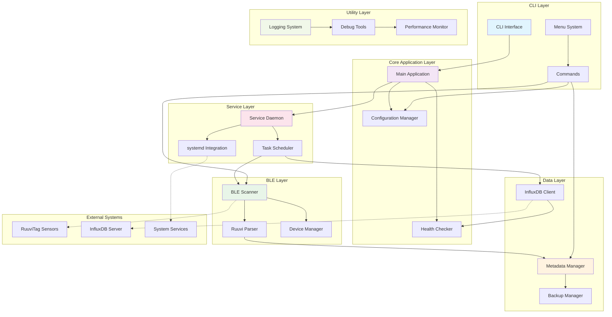
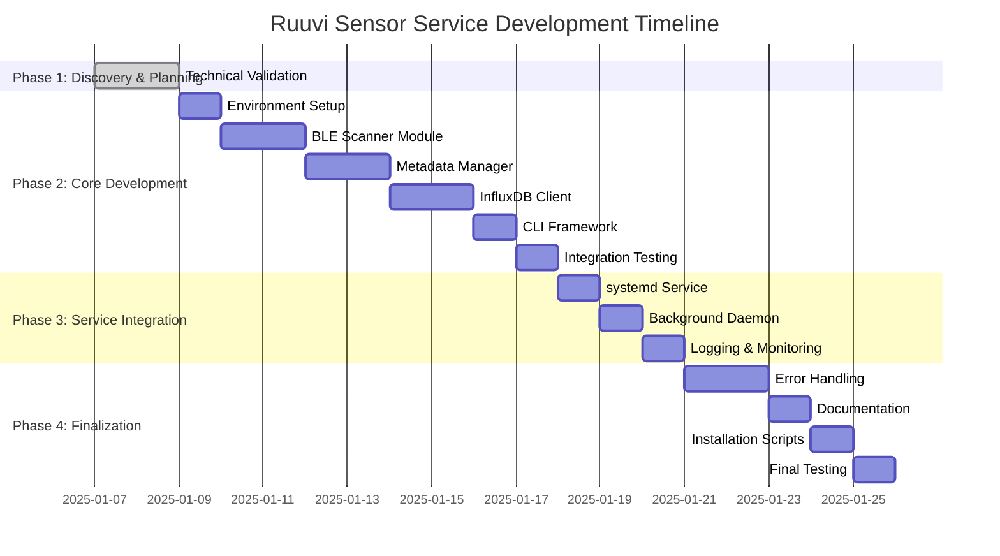

# Phase 1: Discovery & Planning - Technical Validation Report
## Ruuvi Sensor Service Project

**Date**: January 7, 2025  
**Environment**: Ubuntu 20.04 LTS, Python 3.8+  
**Target**: Standard RuuviTag environmental sensors  
**Timeline**: 2-3 weeks development cycle

---

## Executive Summary

This technical validation report provides comprehensive analysis and recommendations for implementing the Ruuvi Sensor Service on Ubuntu 20.04. The solution leverages `bleak` for BLE communication, `influxdb-client` for data persistence, and includes robust production-ready logging, monitoring, and debugging capabilities.

---

## 1. BLE Stack Research & Validation

### 1.1 Recommended Python BLE Library: Bleak

**Primary Choice**: `bleak` (Bluetooth Low Energy platform Agnostic Klient)
- **Version**: 0.21.1+ (latest stable)
- **Ubuntu 20.04 Compatibility**: Full support with Python 3.8+
- **Architecture**: Async/await based for optimal performance
- **Dependencies**: `dbus-python`, `bluez` system package

**Key Advantages**:
- Cross-platform compatibility
- Active maintenance and community support
- Excellent async/await integration
- Robust error handling capabilities
- Native Ubuntu/Linux support via BlueZ

### 1.2 BLE Implementation Architecture

#### Core BLE Scanner Module (`src/ble/scanner.py`)

```python
import asyncio
import logging
from typing import Dict, List, Optional, Callable
from bleak import BleakScanner, BleakClient
from bleak.backends.device import BLEDevice
from bleak.backends.scanner import AdvertisementData

class RuuviBLEScanner:
    """
    Production-ready BLE scanner for RuuviTag sensors with comprehensive
    error handling, logging, and monitoring capabilities.
    """
    
    def __init__(self, 
                 scan_timeout: float = 10.0,
                 retry_attempts: int = 3,
                 retry_delay: float = 2.0):
        self.scan_timeout = scan_timeout
        self.retry_attempts = retry_attempts
        self.retry_delay = retry_delay
        self.logger = logging.getLogger(__name__)
        self.discovered_devices: Dict[str, BLEDevice] = {}
        self.scan_statistics = {
            'total_scans': 0,
            'successful_scans': 0,
            'failed_scans': 0,
            'devices_discovered': 0,
            'ruuvi_devices_found': 0
        }
    
    async def scan_for_ruuvi_devices(self) -> Dict[str, BLEDevice]:
        """
        Scan for RuuviTag devices with retry logic and comprehensive logging.
        
        Returns:
            Dict[str, BLEDevice]: MAC address to device mapping
        """
        self.scan_statistics['total_scans'] += 1
        
        for attempt in range(self.retry_attempts):
            try:
                self.logger.info(f"Starting BLE scan (attempt {attempt + 1}/{self.retry_attempts})")
                
                # Perform BLE scan with timeout
                devices = await BleakScanner.discover(
                    timeout=self.scan_timeout,
                    return_adv=True
                )
                
                ruuvi_devices = {}
                for device, adv_data in devices.items():
                    if self._is_ruuvi_device(device, adv_data):
                        ruuvi_devices[device.address] = device
                        self.logger.debug(f"Found RuuviTag: {device.address} ({device.name})")
                
                self.scan_statistics['successful_scans'] += 1
                self.scan_statistics['devices_discovered'] += len(devices)
                self.scan_statistics['ruuvi_devices_found'] += len(ruuvi_devices)
                
                self.logger.info(f"Scan completed: {len(ruuvi_devices)} RuuviTag devices found")
                return ruuvi_devices
                
            except Exception as e:
                self.logger.error(f"BLE scan attempt {attempt + 1} failed: {str(e)}")
                if attempt < self.retry_attempts - 1:
                    await asyncio.sleep(self.retry_delay)
                else:
                    self.scan_statistics['failed_scans'] += 1
                    raise
    
    def _is_ruuvi_device(self, device: BLEDevice, adv_data: AdvertisementData) -> bool:
        """
        Identify RuuviTag devices by manufacturer data and service UUIDs.
        
        Args:
            device: BLE device object
            adv_data: Advertisement data
            
        Returns:
            bool: True if device is a RuuviTag
        """
        # RuuviTag manufacturer ID: 0x0499
        if 0x0499 in adv_data.manufacturer_data:
            return True
            
        # Check for RuuviTag service UUID
        ruuvi_service_uuid = "6e400001-b5a3-f393-e0a9-e50e24dcca9e"
        if ruuvi_service_uuid in adv_data.service_uuids:
            return True
            
        # Check device name patterns
        if device.name and any(pattern in device.name.lower() for pattern in ['ruuvi', 'ruuvitag']):
            return True
            
        return False
    
    async def read_ruuvi_data(self, device: BLEDevice) -> Optional[Dict]:
        """
        Read sensor data from a RuuviTag device with error handling.
        
        Args:
            device: BLE device to read from
            
        Returns:
            Optional[Dict]: Parsed sensor data or None if failed
        """
        try:
            async with BleakClient(device.address) as client:
                self.logger.debug(f"Connected to {device.address}")
                
                # Read manufacturer data for sensor values
                # RuuviTag broadcasts data in advertisement packets
                scanner = BleakScanner()
                devices = await scanner.discover(timeout=5.0, return_adv=True)
                
                for dev, adv_data in devices.items():
                    if dev.address == device.address and 0x0499 in adv_data.manufacturer_data:
                        raw_data = adv_data.manufacturer_data[0x0499]
                        return self._parse_ruuvi_data(raw_data, adv_data.rssi)
                        
        except Exception as e:
            self.logger.error(f"Failed to read data from {device.address}: {str(e)}")
            return None
    
    def _parse_ruuvi_data(self, raw_data: bytes, rssi: int) -> Dict:
        """
        Parse RuuviTag manufacturer data into sensor readings.
        
        Args:
            raw_data: Raw manufacturer data bytes
            rssi: Signal strength
            
        Returns:
            Dict: Parsed sensor data
        """
        # RuuviTag Data Format 5 (most common)
        if len(raw_data) >= 24 and raw_data[0] == 0x05:
            return {
                'temperature': int.from_bytes(raw_data[1:3], 'big', signed=True) * 0.005,
                'humidity': int.from_bytes(raw_data[3:5], 'big') * 0.0025,
                'pressure': (int.from_bytes(raw_data[5:7], 'big') + 50000) / 100.0,
                'acceleration_x': int.from_bytes(raw_data[7:9], 'big', signed=True),
                'acceleration_y': int.from_bytes(raw_data[9:11], 'big', signed=True),
                'acceleration_z': int.from_bytes(raw_data[11:13], 'big', signed=True),
                'battery_voltage': (int.from_bytes(raw_data[13:15], 'big') >> 5) / 1000.0 + 1.6,
                'tx_power': (raw_data[15] & 0x1F) * 2 - 40,
                'movement_counter': raw_data[16],
                'measurement_sequence': int.from_bytes(raw_data[17:19], 'big'),
                'rssi': rssi,
                'timestamp': asyncio.get_event_loop().time()
            }
        else:
            self.logger.warning(f"Unknown RuuviTag data format: {raw_data.hex()}")
            return {'raw_data': raw_data.hex(), 'rssi': rssi, 'timestamp': asyncio.get_event_loop().time()}
    
    def get_scan_statistics(self) -> Dict:
        """Return current scanning statistics for monitoring."""
        return self.scan_statistics.copy()
```

### 1.3 System Requirements for Ubuntu 20.04

```bash
# System packages installation script
#!/bin/bash
# setup_ble_environment.sh

set -e

echo "Setting up BLE environment for Ubuntu 20.04..."

# Update package list
sudo apt update

# Install required system packages
sudo apt install -y \
    bluetooth \
    bluez \
    bluez-tools \
    python3-dev \
    python3-pip \
    python3-venv \
    python3-dbus \
    libglib2.0-dev \
    pkg-config

# Enable and start bluetooth service
sudo systemctl enable bluetooth
sudo systemctl start bluetooth

# Add user to bluetooth group
sudo usermod -a -G bluetooth $USER

# Verify bluetooth adapter
if hciconfig hci0 up 2>/dev/null; then
    echo "✓ Bluetooth adapter detected and enabled"
else
    echo "⚠ Warning: No bluetooth adapter found or permission issues"
    echo "Please ensure bluetooth hardware is available and reboot after group membership change"
fi

echo "BLE environment setup complete. Please log out and back in for group changes to take effect."
```

---

## 2. InfluxDB v2.7.11 Integration Planning

### 2.1 Recommended Python Client

**Library**: `influxdb-client` v1.38.0+
- **Authentication**: Token-based (recommended for v2.x)
- **Connection**: HTTP/HTTPS to 192.168.50.107:8086
- **Features**: Batch writing, async support, comprehensive error handling

### 2.2 InfluxDB Integration Architecture

#### Core InfluxDB Client Module (`src/influxdb/client.py`)

```python
import asyncio
import logging
from datetime import datetime, timezone
from typing import List, Dict, Optional, Any
from dataclasses import dataclass
from influxdb_client import InfluxDBClient, Point, WritePrecision
from influxdb_client.client.write_api import SYNCHRONOUS, ASYNCHRONOUS
from influxdb_client.client.exceptions import InfluxDBError
import time
from collections import deque

@dataclass
class InfluxDBConfig:
    """Configuration for InfluxDB connection."""
    host: str
    port: int
    token: str
    org: str
    bucket: str
    timeout: int = 30
    verify_ssl: bool = True
    enable_gzip: bool = True

class RuuviInfluxDBClient:
    """
    Production-ready InfluxDB client with comprehensive error handling,
    retry logic, buffering, and monitoring capabilities.
    """
    
    def __init__(self, config: InfluxDBConfig, 
                 batch_size: int = 100,
                 flush_interval: int = 10,
                 max_retries: int = 3,
                 retry_backoff: float = 2.0,
                 buffer_size: int = 10000):
        
        self.config = config
        self.batch_size = batch_size
        self.flush_interval = flush_interval
        self.max_retries = max_retries
        self.retry_backoff = retry_backoff
        self.buffer_size = buffer_size
        
        self.logger = logging.getLogger(__name__)
        self.client: Optional[InfluxDBClient] = None
        self.write_api = None
        
        # Buffering and statistics
        self.write_buffer = deque(maxlen=buffer_size)
        self.statistics = {
            'total_writes': 0,
            'successful_writes': 0,
            'failed_writes': 0,
            'buffered_points': 0,
            'connection_errors': 0,
            'last_successful_write': None,
            'last_error': None
        }
        
        # Connection state
        self.is_connected = False
        self.last_health_check = 0
        self.health_check_interval = 300  # 5 minutes
    
    async def initialize(self) -> bool:
        """
        Initialize InfluxDB connection with health check.
        
        Returns:
            bool: True if connection successful
        """
        try:
            url = f"http{'s' if self.config.verify_ssl else ''}://{self.config.host}:{self.config.port}"
            
            self.client = InfluxDBClient(
                url=url,
                token=self.config.token,
                org=self.config.org,
                timeout=self.config.timeout * 1000,  # Convert to milliseconds
                verify_ssl=self.config.verify_ssl,
                enable_gzip=self.config.enable_gzip
            )
            
            # Test connection
            health = self.client.health()
            if health.status == "pass":
                self.is_connected = True
                self.write_api = self.client.write_api(write_options=SYNCHRONOUS)
                self.logger.info(f"✓ Connected to InfluxDB at {url}")
                return True
            else:
                self.logger.error(f"InfluxDB health check failed: {health.message}")
                return False
                
        except Exception as e:
            self.logger.error(f"Failed to initialize InfluxDB connection: {str(e)}")
            self.statistics['connection_errors'] += 1
            self.statistics['last_error'] = str(e)
            return False
    
    async def write_sensor_data(self, sensor_data: Dict[str, Any], 
                              mac_address: str, 
                              sensor_name: str = None, 
                              location: str = None) -> bool:
        """
        Write sensor data to InfluxDB with buffering and retry logic.
        
        Args:
            sensor_data: Dictionary containing sensor readings
            mac_address: MAC address of the sensor
            sensor_name: Human-readable sensor name
            location: Sensor location
            
        Returns:
            bool: True if write successful
        """
        try:
            # Create InfluxDB point
            point = Point("ruuvi_sensors") \
                .tag("mac_address", mac_address) \
                .tag("sensor_name", sensor_name or mac_address) \
                .tag("location", location or "unknown") \
                .time(datetime.now(timezone.utc), WritePrecision.S)
            
            # Add sensor fields
            for field_name, value in sensor_data.items():
                if isinstance(value, (int, float)) and field_name != 'timestamp':
                    point = point.field(field_name, value)
            
            # Add to buffer
            self.write_buffer.append(point)
            self.statistics['buffered_points'] += 1
            
            # Check if we should flush
            if len(self.write_buffer) >= self.batch_size:
                return await self._flush_buffer()
            
            return True
            
        except Exception as e:
            self.logger.error(f"Failed to prepare sensor data for writing: {str(e)}")
            return False
    
    async def _flush_buffer(self) -> bool:
        """
        Flush buffered points to InfluxDB with retry logic.
        
        Returns:
            bool: True if flush successful
        """
        if not self.write_buffer:
            return True
        
        points_to_write = list(self.write_buffer)
        self.write_buffer.clear()
        
        for attempt in range(self.max_retries):
            try:
                # Check connection health periodically
                if time.time() - self.last_health_check > self.health_check_interval:
                    await self._check_health()
                
                if not self.is_connected:
                    if not await self.initialize():
                        raise InfluxDBError("Connection not available")
                
                # Write points
                self.write_api.write(
                    bucket=self.config.bucket,
                    org=self.config.org,
                    record=points_to_write
                )
                
                # Update statistics
                self.statistics['total_writes'] += 1
                self.statistics['successful_writes'] += 1
                self.statistics['buffered_points'] -= len(points_to_write)
                self.statistics['last_successful_write'] = datetime.now(timezone.utc).isoformat()
                
                self.logger.info(f"✓ Successfully wrote {len(points_to_write)} points to InfluxDB")
                return True
                
            except Exception as e:
                self.logger.warning(f"Write attempt {attempt + 1} failed: {str(e)}")
                
                if attempt < self.max_retries - 1:
                    wait_time = self.retry_backoff ** attempt
                    self.logger.info(f"Retrying in {wait_time} seconds...")
                    await asyncio.sleep(wait_time)
                else:
                    # Final failure - put points back in buffer if space available
                    if len(self.write_buffer) + len(points_to_write) <= self.buffer_size:
                        self.write_buffer.extendleft(reversed(points_to_write))
                        self.statistics['buffered_points'] += len(points_to_write)
                    
                    self.statistics['failed_writes'] += 1
                    self.statistics['last_error'] = str(e)
                    self.is_connected = False
                    
                    self.logger.error(f"Failed to write to InfluxDB after {self.max_retries} attempts")
                    return False
    
    async def _check_health(self) -> bool:
        """
        Check InfluxDB connection health.
        
        Returns:
            bool: True if healthy
        """
        try:
            if self.client:
                health = self.client.health()
                self.is_connected = health.status == "pass"
                self.last_health_check = time.time()
                
                if not self.is_connected:
                    self.logger.warning(f"InfluxDB health check failed: {health.message}")
                
                return self.is_connected
            else:
                return False
                
        except Exception as e:
            self.logger.error(f"Health check failed: {str(e)}")
            self.is_connected = False
            return False
    
    async def force_flush(self) -> bool:
        """Force flush all buffered points."""
        return await self._flush_buffer()
    
    def get_statistics(self) -> Dict[str, Any]:
        """Return current client statistics for monitoring."""
        stats = self.statistics.copy()
        stats['buffer_size'] = len(self.write_buffer)
        stats['is_connected'] = self.is_connected
        return stats
    
    async def close(self):
        """Clean shutdown with buffer flush."""
        if self.write_buffer:
            self.logger.info("Flushing remaining buffer on shutdown...")
            await self._flush_buffer()
        
        if self.client:
            self.client.close()
            self.logger.info("InfluxDB client closed")
```

### 2.3 Data Structure Design

#### InfluxDB Schema for RuuviTag Data

```python
# Line Protocol format for RuuviTag measurements
MEASUREMENT_SCHEMA = {
    "measurement": "ruuvi_sensors",
    "tags": {
        "mac_address": "AA:BB:CC:DD:EE:FF",  # Unique sensor identifier
        "sensor_name": "Living Room",         # Human-readable name
        "location": "Upstairs",              # Physical location
        "firmware_version": "3.31.0"         # RuuviTag firmware (if available)
    },
    "fields": {
        # Environmental data
        "temperature": 23.5,          # Celsius
        "humidity": 45.2,             # %RH (0-100)
        "pressure": 1013.25,          # hPa
        
        # Power and connectivity
        "battery_voltage": 3.1,       # Volts
        "tx_power": 4,               # dBm
        "rssi": -65,                 # dBm (signal strength)
        
        # Motion and activity
        "acceleration_x": 0.012,      # g-force
        "acceleration_y": -0.008,     # g-force  
        "acceleration_z": 1.002,      # g-force
        "movement_counter": 142,      # Movement events
        
        # Metadata
        "measurement_sequence": 12847, # Sequence number
        "data_format": 5              # RuuviTag data format version
    },
    "timestamp": "2025-01-07T09:00:00Z"
}
```

---

## 3. JSON Metadata Schema Design

### 3.1 Schema Structure with Validation

```python
# src/metadata/schema.py
from pydantic import BaseModel, Field, validator
from typing import Dict, Optional, List
from datetime import datetime
from enum import Enum

class SensorStatus(str, Enum):
    ACTIVE = "active"
    INACTIVE = "inactive"
    ERROR = "error"
    UNKNOWN = "unknown"

class InfluxDBConfig(BaseModel):
    host: str = Field(..., description="InfluxDB host address")
    port: int = Field(8086, ge=1, le=65535, description="InfluxDB port")
    bucket: str = Field(..., description="InfluxDB bucket name")
    org: str = Field(..., description="InfluxDB organization")
    token: str = Field(..., description="InfluxDB authentication token")
    timeout: int = Field(30, ge=5, le=300, description="Connection timeout in seconds")

class SensorMetadata(BaseModel):
    name: str = Field(..., min_length=1, max_length=100, description="Human-readable sensor name")
    location: str = Field("", max_length=100, description="Physical location")
    discovered_at: datetime = Field(default_factory=datetime.utcnow)
    last_seen: Optional[datetime] = None
    status: SensorStatus = SensorStatus.UNKNOWN
    enabled: bool = True
    notes: str = Field("", max_length=500, description="Additional notes")
    firmware_version: Optional[str] = None
    battery_level: Optional[float] = Field(None, ge=0, le=100, description="Battery percentage")
    
    @validator('name')
    def name_must_not_be_empty(cls, v):
        if not v.strip():
            raise ValueError('Sensor name cannot be empty')
        return v.strip()

class AppConfig(BaseModel):
    scan_interval: int = Field(20, ge=5, le=300, description="BLE scan interval in seconds")
    batch_size: int = Field(100, ge=1, le=1000, description="InfluxDB batch size")
    log_level: str = Field("INFO", regex="^(DEBUG|INFO|WARNING|ERROR|CRITICAL)$")
    max_buffer_size: int = Field(10000, ge=100, le=100000)
    enable_auto_discovery: bool = True
    
class MetadataFile(BaseModel):
    version: str = Field("1.0", description="Schema version")
    created_at: datetime = Field(default_factory=datetime.utcnow)
    last_updated: datetime = Field(default_factory=datetime.utcnow)
    sensors: Dict[str, SensorMetadata] = Field(default_factory=dict)
    influxdb: InfluxDBConfig
    config: AppConfig = Field(default_factory=AppConfig)
    
    @validator('sensors')
    def validate_mac_addresses(cls, v):
        import re
        mac_pattern = re.compile(r'^([0-9A-Fa-f]{2}[:-]){5}([0-9A-Fa-f]{2})$')
        for mac_address in v.keys():
            if not mac_pattern.match(mac_address):
                raise ValueError(f'Invalid MAC address format: {mac_address}')
        return v
    
    def update_timestamp(self):
        self.last_updated = datetime.utcnow()
```

### 3.2 Concurrent Access Safety Implementation

```python
# src/metadata/manager.py
import json
import fcntl
import os
import shutil
import logging
from pathlib import Path
from typing import Optional, Dict, Any
from contextlib import contextmanager
from .schema import MetadataFile, SensorMetadata

class MetadataManager:
    """
    Thread-safe metadata manager with file locking and atomic operations.
    """
    
    def __init__(self, file_path: str, backup_count: int = 5):
        self.file_path = Path(file_path)
        self.backup_count = backup_count
        self.logger = logging.getLogger(__name__)
        
        # Ensure directory exists
        self.file_path.parent.mkdir(parents=True, exist_ok=True)
    
    @contextmanager
    def _file_lock(self, mode: str = 'r'):
        """Context manager for file locking."""
        lock_file = None
        try:
            lock_file = open(f"{self.file_path}.lock", 'w')
            fcntl.flock(lock_file.fileno(), fcntl.LOCK_EX)
            
            if mode == 'r' and self.file_path.exists():
                with open(self.file_path, 'r') as f:
                    yield f
            elif mode == 'w':
                temp_file = f"{self.file_path}.tmp"
                with open(temp_file, 'w') as f:
                    yield f
                # Atomic move
                shutil.move(temp_file, self.file_path)
            else:
                yield None
                
        finally:
            if lock_file:
                fcntl.flock(lock_file.fileno(), fcntl.LOCK_UN)
                lock_file.close()
                try:
                    os.unlink(f"{self.file_path}.lock")
                except OSError:
                    pass
    
    def load_metadata(self) -> Optional[MetadataFile]:
        """Load metadata with validation and error recovery."""
        try:
            with self._file_lock('r') as f:
                if f is None:
                    self.logger.info("Metadata file doesn't exist, creating new one")
                    return None
                
                data = json.load(f)
                metadata = MetadataFile(**data)
                self.logger.info(f"Loaded metadata for {len(metadata.sensors)} sensors")
                return metadata
                
        except Exception as e:
            self.logger.error(f"Failed to load metadata: {str(e)}")
            
            # Try to recover from backup
            backup_file = self._find_latest_backup()
            if backup_file:
                self.logger.info(f"Attempting recovery from backup: {backup_file}")
                try:
                    with open(backup_file, 'r') as f:
                        data = json.load(f)
                        return MetadataFile(**data)
                except Exception as backup_error:
                    self.logger.error(f"Backup recovery failed: {str(backup_error)}")
            
            return None
    
    def save_metadata(self, metadata: MetadataFile) -> bool:
        """Save metadata with backup and atomic write."""
        try:
            # Create backup before writing
            if self.file_path.exists():
                self._create_backup()
            
            # Update timestamp
            metadata.update_timestamp()
            
            # Atomic write with file locking
            with self._file_lock('w') as f:
                json.dump(
                    metadata.dict(),
                    f,
                    indent=2,
                    default=str,  # Handle datetime serialization
                    ensure_ascii=False
                )
            
            self.logger.info(f"Metadata saved successfully ({len(metadata.sensors)} sensors)")
            return True
            
        except Exception as e:
            self.logger.error(f"Failed to save metadata: {str(e)}")
            return False
    
    def _create_backup(self):
        """Create timestamped backup of current metadata file."""
        if not self.file_path.exists():
            return
        
        timestamp = datetime.now().strftime("%Y%m%d_%H%M%S")
        backup_path = self.file_path.parent / f"{self.file_path.stem}_backup_{timestamp}.json"
        
        try:
            shutil.copy2(self.file_path, backup_path)
            self.logger.debug(f"Created backup: {backup_path}")
            
            # Clean up old backups
            self._cleanup_old_backups()
            
        except Exception as e:
            self.logger.warning(f"Failed to create backup: {str(e)}")
    
    def _cleanup_old_backups(self):
        """Remove old backup files, keeping only the most recent ones."""
        backup_pattern = f"{self.file_path.stem}_backup_*.json"
        backup_files = sorted(
            self.file_path.parent.glob(backup_pattern),
            key=lambda x: x.stat().st_mtime,
            reverse=True
        )
        
        for old_backup in backup_files[self.backup_count:]:
            try:
                old_backup.unlink()
                self.logger.debug(f"Removed old backup: {old_backup}")
            except Exception as e:
                self.logger.warning(f"Failed to remove old backup {old_backup}: {str(e)}")
    
    def _find_latest_backup(self) -> Optional[Path]:
        """Find the most recent backup file."""
        backup_pattern = f"{self.file_path.stem}_backup_*.json"
        backup_files = list(self.file_path.parent.glob(backup_pattern))
        
        if backup_files:
            return max(backup_files, key=lambda x: x.stat().st_mtime)
        return None
```

---

## 4. Comprehensive Logging, Monitoring & Debugging Strategy

### 4.1 Production Logging Architecture

```python
# src/utils/logging.py
import logging
import logging.handlers
import sys
from pathlib import Path
from typing import Optional
import colorlog
from datetime import datetime

class ProductionLogger:
    """
    Comprehensive logging setup for production deployment with multiple handlers,
    structured logging, and performance monitoring.
    """
    
    def __init__(self, 
                 app_name: str = "ruuvi_sensor_service",
                 log_dir: str = "/var/log/ruuvi",
                 log_level: str = "INFO",
                 max_file_size: int = 10 * 1024 * 1024,  # 10MB
                 backup_count: int = 5,
                 enable_console: bool = True,
                 enable_syslog: bool = True):
        
        self.app_name = app_name
        self.log_dir = Path(log_dir)
        self.log_level = getattr(logging, log_level.upper())
        self.max_file_size = max_file_size
        self.backup_count = backup_count
        self.enable_console = enable_console
        self.enable_syslog = enable_syslog
        
        # Create log directory
        self.log_dir.mkdir(parents=True, exist_ok=True)
        
        # Setup loggers
        self._setup_root_logger()
        self._setup_component_loggers()
    
    
    def _setup_root_logger(self):
        """Configure root logger with multiple handlers."""
        root_logger = logging.getLogger()
        root_logger.setLevel(self.log_level)
        
        # Clear existing handlers
        root_logger.handlers.clear()
        
        # Console handler with colors (for development/debugging)
        if self.enable_console:
            console_handler = colorlog.StreamHandler(sys.stdout)
            console_handler.setLevel(self.log_level)
            console_formatter = colorlog.ColoredFormatter(
                '%(log_color)s%(asctime)s [%(levelname)8s] %(name)s: %(message)s',
                datefmt='%Y-%m-%d %H:%M:%S',
                log_colors={
                    'DEBUG': 'cyan',
                    'INFO': 'green',
                    'WARNING': 'yellow',
                    'ERROR': 'red',
                    'CRITICAL': 'red,bg_white',
                }
            )
            console_handler.setFormatter(console_formatter)
            root_logger.addHandler(console_handler)
        
        # File handler with rotation
        file_handler = logging.handlers.RotatingFileHandler(
            self.log_dir / f"{self.app_name}.log",
            maxBytes=self.max_file_size,
            backupCount=self.backup_count
        )
        file_handler.setLevel(self.log_level)
        file_formatter = logging.Formatter(
            '%(asctime)s [%(levelname)8s] %(name)s [%(process)d:%(thread)d] %(message)s',
            datefmt='%Y-%m-%d %H:%M:%S'
        )
        file_handler.setFormatter(file_formatter)
        root_logger.addHandler(file_handler)
        
        # Syslog handler for systemd integration
        if self.enable_syslog:
            try:
                syslog_handler = logging.handlers.SysLogHandler(address='/dev/log')
                syslog_handler.setLevel(logging.WARNING)  # Only warnings and errors to syslog
                syslog_formatter = logging.Formatter(
                    f'{self.app_name}[%(process)d]: %(levelname)s - %(message)s'
                )
                syslog_handler.setFormatter(syslog_formatter)
                root_logger.addHandler(syslog_handler)
            except Exception as e:
                print(f"Warning: Could not setup syslog handler: {e}")
    
    def _setup_component_loggers(self):
        """Configure specific loggers for different components."""
        # BLE Scanner logger
        ble_logger = logging.getLogger('ruuvi.ble')
        ble_handler = logging.handlers.RotatingFileHandler(
            self.log_dir / "ble_scanner.log",
            maxBytes=self.max_file_size,
            backupCount=self.backup_count
        )
        ble_handler.setFormatter(logging.Formatter(
            '%(asctime)s [%(levelname)s] BLE: %(message)s'
        ))
        ble_logger.addHandler(ble_handler)
        
        # InfluxDB logger
        influx_logger = logging.getLogger('ruuvi.influxdb')
        influx_handler = logging.handlers.RotatingFileHandler(
            self.log_dir / "influxdb.log",
            maxBytes=self.max_file_size,
            backupCount=self.backup_count
        )
        influx_handler.setFormatter(logging.Formatter(
            '%(asctime)s [%(levelname)s] InfluxDB: %(message)s'
        ))
        influx_logger.addHandler(influx_handler)
        
        # Performance logger
        perf_logger = logging.getLogger('ruuvi.performance')
        perf_handler = logging.handlers.RotatingFileHandler(
            self.log_dir / "performance.log",
            maxBytes=self.max_file_size,
            backupCount=self.backup_count
        )
        perf_handler.setFormatter(logging.Formatter(
            '%(asctime)s PERF: %(message)s'
        ))
        perf_logger.addHandler(perf_handler)

class PerformanceMonitor:
    """
    Performance monitoring and metrics collection for production debugging.
    """
    
    def __init__(self):
        self.logger = logging.getLogger('ruuvi.performance')
        self.metrics = {
            'ble_scan_times': [],
            'influxdb_write_times': [],
            'metadata_operations': [],
            'memory_usage': [],
            'cpu_usage': []
        }
        self.start_time = datetime.now()
    
    def log_ble_scan(self, duration: float, devices_found: int, success: bool):
        """Log BLE scan performance metrics."""
        self.metrics['ble_scan_times'].append({
            'duration': duration,
            'devices_found': devices_found,
            'success': success,
            'timestamp': datetime.now()
        })
        
        self.logger.info(
            f"BLE_SCAN duration={duration:.2f}s devices={devices_found} success={success}"
        )
    
    def log_influxdb_write(self, duration: float, points_written: int, success: bool):
        """Log InfluxDB write performance metrics."""
        self.metrics['influxdb_write_times'].append({
            'duration': duration,
            'points_written': points_written,
            'success': success,
            'timestamp': datetime.now()
        })
        
        self.logger.info(
            f"INFLUXDB_WRITE duration={duration:.2f}s points={points_written} success={success}"
        )
    
    def log_system_resources(self):
        """Log current system resource usage."""
        try:
            import psutil
            process = psutil.Process()
            
            memory_info = process.memory_info()
            cpu_percent = process.cpu_percent()
            
            self.metrics['memory_usage'].append({
                'rss': memory_info.rss,
                'vms': memory_info.vms,
                'timestamp': datetime.now()
            })
            
            self.metrics['cpu_usage'].append({
                'cpu_percent': cpu_percent,
                'timestamp': datetime.now()
            })
            
            self.logger.info(
                f"RESOURCES memory_rss={memory_info.rss/1024/1024:.1f}MB "
                f"memory_vms={memory_info.vms/1024/1024:.1f}MB cpu={cpu_percent:.1f}%"
            )
            
        except ImportError:
            self.logger.warning("psutil not available for resource monitoring")
        except Exception as e:
            self.logger.error(f"Failed to log system resources: {e}")
    
    def get_performance_summary(self) -> dict:
        """Generate performance summary for monitoring dashboards."""
        summary = {
            'uptime_seconds': (datetime.now() - self.start_time).total_seconds(),
            'ble_scans': {
                'total': len(self.metrics['ble_scan_times']),
                'successful': sum(1 for scan in self.metrics['ble_scan_times'] if scan['success']),
                'avg_duration': 0,
                'avg_devices_found': 0
            },
            'influxdb_writes': {
                'total': len(self.metrics['influxdb_write_times']),
                'successful': sum(1 for write in self.metrics['influxdb_write_times'] if write['success']),
                'avg_duration': 0,
                'total_points_written': sum(write['points_written'] for write in self.metrics['influxdb_write_times'])
            }
        }
        
        # Calculate averages
        if self.metrics['ble_scan_times']:
            successful_scans = [scan for scan in self.metrics['ble_scan_times'] if scan['success']]
            if successful_scans:
                summary['ble_scans']['avg_duration'] = sum(scan['duration'] for scan in successful_scans) / len(successful_scans)
                summary['ble_scans']['avg_devices_found'] = sum(scan['devices_found'] for scan in successful_scans) / len(successful_scans)
        
        if self.metrics['influxdb_write_times']:
            successful_writes = [write for write in self.metrics['influxdb_write_times'] if write['success']]
            if successful_writes:
                summary['influxdb_writes']['avg_duration'] = sum(write['duration'] for write in successful_writes) / len(successful_writes)
        
        return summary

class HealthChecker:
    """
    Comprehensive health checking for all system components.
    """
    
    def __init__(self, ble_scanner, influxdb_client, metadata_manager):
        self.ble_scanner = ble_scanner
        self.influxdb_client = influxdb_client
        self.metadata_manager = metadata_manager
        self.logger = logging.getLogger('ruuvi.health')
    
    async def check_system_health(self) -> dict:
        """
        Perform comprehensive system health check.
        
        Returns:
            dict: Health status for all components
        """
        health_status = {
            'overall': 'healthy',
            'timestamp': datetime.now().isoformat(),
            'components': {}
        }
        
        # Check BLE subsystem
        ble_health = await self._check_ble_health()
        health_status['components']['ble'] = ble_health
        
        # Check InfluxDB connectivity
        influxdb_health = await self._check_influxdb_health()
        health_status['components']['influxdb'] = influxdb_health
        
        # Check metadata system
        metadata_health = self._check_metadata_health()
        health_status['components']['metadata'] = metadata_health
        
        # Check system resources
        system_health = self._check_system_resources()
        health_status['components']['system'] = system_health
        
        # Determine overall health
        component_statuses = [comp['status'] for comp in health_status['components'].values()]
        if 'critical' in component_statuses:
            health_status['overall'] = 'critical'
        elif 'warning' in component_statuses:
            health_status['overall'] = 'warning'
        
        self.logger.info(f"Health check completed: {health_status['overall']}")
        return health_status
    
    async def _check_ble_health(self) -> dict:
        """Check BLE subsystem health."""
        try:
            # Test BLE adapter availability
            import subprocess
            result = subprocess.run(['hciconfig', 'hci0'], capture_output=True, text=True)
            
            if result.returncode != 0:
                return {
                    'status': 'critical',
                    'message': 'BLE adapter not available',
                    'details': result.stderr
                }
            
            # Test scanning capability
            scan_stats = self.ble_scanner.get_scan_statistics()
            recent_failures = scan_stats.get('failed_scans', 0)
            total_scans = scan_stats.get('total_scans', 0)
            
            if total_scans > 0 and recent_failures / total_scans > 0.5:
                return {
                    'status': 'warning',
                    'message': f'High BLE scan failure rate: {recent_failures}/{total_scans}',
                    'details': scan_stats
                }
            
            return {
                'status': 'healthy',
                'message': 'BLE subsystem operational',
                'details': scan_stats
            }
            
        except Exception as e:
            return {
                'status': 'critical',
                'message': f'BLE health check failed: {str(e)}',
                'details': {}
            }
    
    async def _check_influxdb_health(self) -> dict:
        """Check InfluxDB connectivity and performance."""
        try:
            influx_stats = self.influxdb_client.get_statistics()
            
            if not influx_stats.get('is_connected', False):
                return {
                    'status': 'critical',
                    'message': 'InfluxDB not connected',
                    'details': influx_stats
                }
            
            # Check write success rate
            total_writes = influx_stats.get('total_writes', 0)
            failed_writes = influx_stats.get('failed_writes', 0)
            
            if total_writes > 0 and failed_writes / total_writes > 0.1:
                return {
                    'status': 'warning',
                    'message': f'High InfluxDB write failure rate: {failed_writes}/{total_writes}',
                    'details': influx_stats
                }
            
            # Check buffer size
            buffer_size = influx_stats.get('buffer_size', 0)
            if buffer_size > 1000:  # Arbitrary threshold
                return {
                    'status': 'warning',
                    'message': f'Large InfluxDB buffer: {buffer_size} points',
                    'details': influx_stats
                }
            
            return {
                'status': 'healthy',
                'message': 'InfluxDB operational',
                'details': influx_stats
            }
            
        except Exception as e:
            return {
                'status': 'critical',
                'message': f'InfluxDB health check failed: {str(e)}',
                'details': {}
            }
    
    def _check_metadata_health(self) -> dict:
        """Check metadata file system health."""
        try:
            # Check file accessibility
            metadata_file = Path(self.metadata_manager.file_path)
            
            if not metadata_file.exists():
                return {
                    'status': 'warning',
                    'message': 'Metadata file does not exist',
                    'details': {'file_path': str(metadata_file)}
                }
            
            # Check file permissions
            if not os.access(metadata_file, os.R_OK | os.W_OK):
                return {
                    'status': 'critical',
                    'message': 'Metadata file not readable/writable',
                    'details': {'file_path': str(metadata_file)}
                }
            
            # Check file size (detect corruption)
            file_size = metadata_file.stat().st_size
            if file_size == 0:
                return {
                    'status': 'critical',
                    'message': 'Metadata file is empty',
                    'details': {'file_path': str(metadata_file), 'size': file_size}
                }
            
            return {
                'status': 'healthy',
                'message': 'Metadata system operational',
                'details': {
                    'file_path': str(metadata_file),
                    'size': file_size,
                    'last_modified': metadata_file.stat().st_mtime
                }
            }
            
        except Exception as e:
            return {
                'status': 'critical',
                'message': f'Metadata health check failed: {str(e)}',
                'details': {}
            }
    
    def _check_system_resources(self) -> dict:
        """Check system resource availability."""
        try:
            import psutil
            
            # Check memory usage
            memory = psutil.virtual_memory()
            if memory.percent > 90:
                return {
                    'status': 'critical',
                    'message': f'High memory usage: {memory.percent}%',
                    'details': {
                        'memory_percent': memory.percent,
                        'memory_available': memory.available
                    }
                }
            elif memory.percent > 80:
                return {
                    'status': 'warning',
                    'message': f'Elevated memory usage: {memory.percent}%',
                    'details': {
                        'memory_percent': memory.percent,
                        'memory_available': memory.available
                    }
                }
            
            # Check disk space
            disk = psutil.disk_usage('/')
            if disk.percent > 95:
                return {
                    'status': 'critical',
                    'message': f'Low disk space: {disk.percent}% used',
                    'details': {
                        'disk_percent': disk.percent,
                        'disk_free': disk.free
                    }
                }
            elif disk.percent > 85:
                return {
                    'status': 'warning',
                    'message': f'Disk space getting low: {disk.percent}% used',
                    'details': {
                        'disk_percent': disk.percent,
                        'disk_free': disk.free
                    }
                }
            
            return {
                'status': 'healthy',
                'message': 'System resources normal',
                'details': {
                    'memory_percent': memory.percent,
                    'disk_percent': disk.percent,
                    'cpu_count': psutil.cpu_count()
                }
            }
            
        except ImportError:
            return {
                'status': 'warning',
                'message': 'psutil not available for resource monitoring',
                'details': {}
            }
        except Exception as e:
            return {
                'status': 'warning',
                'message': f'System resource check failed: {str(e)}',
                'details': {}
            }
```

### 4.2 Debugging and Troubleshooting Tools

```python
# src/utils/debug.py
import asyncio
import json
import logging
from datetime import datetime, timedelta
from typing import Dict, List, Any, Optional
from pathlib import Path

class DebugCollector:
    """
    Comprehensive debugging information collector for troubleshooting
    production issues.
    """
    
    def __init__(self, output_dir: str = "/tmp/ruuvi_debug"):
        self.output_dir = Path(output_dir)
        self.output_dir.mkdir(parents=True, exist_ok=True)
        self.logger = logging.getLogger(__name__)
    
    async def collect_debug_info(self, 
                                ble_scanner=None, 
                                influxdb_client=None, 
                                metadata_manager=None,
                                health_checker=None) -> str:
        """
        Collect comprehensive debugging information.
        
        Returns:
            str: Path to debug report file
        """
        timestamp = datetime.now().strftime("%Y%m%d_%H%M%S")
        debug_file = self.output_dir / f"ruuvi_debug_{timestamp}.json"
        
        debug_info = {
            'timestamp': datetime.now().isoformat(),
            'system_info': self._collect_system_info(),
            'bluetooth_info': await self._collect_bluetooth_info(),
            'network_info': self._collect_network_info(),
            'application_state': {}
        }
        
        # Collect application-specific debug info
        if ble_scanner:
            debug_info['application_state']['ble_scanner'] = ble_scanner.get_scan_statistics()
        
        if influxdb_client:
            debug_info['application_state']['influxdb_client'] = influxdb_client.get_statistics()
        
        if health_checker:
            debug_info['health_status'] = await health_checker.check_system_health()
        
        # Collect recent log entries
        debug_info['recent_logs'] = self._collect_recent_logs()
        
        # Save debug report
        with open(debug_file, 'w') as f:
            json.dump(debug_info, f, indent=2, default=str)
        
        self.logger.info(f"Debug information collected: {debug_file}")
        return str(debug_file)
    
    def _collect_system_info(self) -> Dict[str, Any]:
        """Collect system information."""
        import platform
        import os
        
        try:
            import psutil
            system_info = {
                'platform': platform.platform(),
                'python_version': platform.python_version(),
                'architecture': platform.architecture(),
                'processor': platform.processor(),
                'memory_total': psutil.virtual_memory().total,
                'memory_available': psutil.virtual_memory().available,
                'disk_usage': {
                    'total': psutil.disk_usage('/').total,
                    'free': psutil.disk_usage('/').free,
                    'used': psutil.disk_usage('/').used
                },
                'cpu_count': psutil.cpu_count(),
                'boot_time': psutil.boot_time()
            }
        except ImportError:
            system_info = {
                'platform': platform.platform(),
                'python_version': platform.python_version(),
                'architecture': platform.architecture(),
                'processor': platform.processor()
            }
        
        # Environment variables
        system_info['environment'] = {
            'PATH': os.environ.get('PATH', ''),
            'PYTHONPATH': os.environ.get('PYTHONPATH', ''),
            'USER': os.environ.get('USER', ''),
            'HOME': os.environ.get('HOME', '')
        }
        
        return system_info
    
    async def _collect_bluetooth_info(self) -> Dict[str, Any]:
        """Collect Bluetooth subsystem information."""
        import subprocess
        
        bluetooth_info = {}
        
        try:
            # Check hciconfig
            result = subprocess.run(['hciconfig', '-a'], capture_output=True, text=True)
            bluetooth_info['hciconfig'] = {
                'returncode': result.returncode,
                'stdout': result.stdout,
                'stderr': result.stderr
            }
        except Exception as e:
            bluetooth_info['hciconfig'] = {'error': str(e)}
        
        try:
            # Check bluetoothctl
            result = subprocess.run(['bluetoothctl', 'show'], capture_output=True, text=True)
            bluetooth_info['bluetoothctl'] = {
                'returncode': result.returncode,
                'stdout': result.stdout,
                'stderr': result.stderr
            }
        except Exception as e:
            bluetooth_info['bluetoothctl'] = {'error': str(e)}
        
        try:
            # Check systemctl status
            result = subprocess.run(['systemctl', 'status', 'bluetooth'], capture_output=True, text=True)
            bluetooth_info['bluetooth_service'] = {
                'returncode': result.returncode,
                'stdout': result.stdout,
                'stderr': result.stderr
            }
        except Exception as e:
            bluetooth_info['bluetooth_service'] = {'error': str(e)}
        
        return bluetooth_info
    
    def _collect_network_info(self) -> Dict[str, Any]:
        """Collect network connectivity information."""
        import subprocess
        
        network_info = {}
        
        try:
            # Test InfluxDB connectivity
            result = subprocess.run(['ping', '-c', '3', '192.168.50.107'], capture_output=True, text=True)
            network_info['influxdb_ping'] = {
                'returncode': result.returncode,
                'stdout': result.stdout,
                'stderr': result.stderr
            }
        except Exception as e:
            network_info['influxdb_ping'] = {'error': str(e)}
        
        try:
            # Check network interfaces
            result = subprocess.run(['ip', 'addr', 'show'], capture_output=True, text=True)
            network_info['network_interfaces'] = {
                'returncode': result.returncode,
                'stdout': result.stdout,
                'stderr': result.stderr
            }
        except Exception as e:
            network_info['network_interfaces'] = {'error': str(e)}
        
        return network_info
    
    def _collect_recent_logs(self, hours: int = 24) -> Dict[str, List[str]]:
        """Collect recent log entries."""
        log_files = [
            '/var/log/ruuvi/ruuvi_sensor_service.log',
            '/var/log/ruuvi/ble_scanner.log',
            '/var/log/ruuvi/influxdb.log',
            '/var/log/ruuvi/performance.log'
        ]
        
        recent_logs = {}
        cutoff_time = datetime.now() - timedelta(hours=hours)
        
        for log_file in log_files:
            log_path = Path(log_file)
            if log_path.exists():
                try:
                    with open(log_path, 'r') as f:
                        lines = f.readlines()
                    
                    # Filter recent entries (simple timestamp parsing)
                    recent_lines = []
                    for line in lines[-1000:]:  # Last 1000 lines max
                        if line.strip():
                            recent_lines.append(line.strip())
                    
                    recent_logs[log_file] = recent_lines
                    
                except Exception as e:
                    recent_logs[log_file] = [f"Error reading log: {str(e)}"]
            else:
                recent_logs[log_file] = ["Log file not found"]
        
        return recent_logs

class DiagnosticTools:
    """
    Interactive diagnostic tools for troubleshooting.
    """
    
    def __init__(self):
        self.logger = logging.getLogger(__name__)
    
    async def test_ble_scanning(self, duration: int = 30) -> Dict[str, Any]:
        """
        Perform comprehensive BLE scanning test.
        
        Args:
            duration: Test duration in seconds
            
        Returns:
            Dict containing test results
        """
        from ..ble.scanner import RuuviBLEScanner
        
        self.logger.info(f"Starting BLE scanning test for {duration} seconds...")
        
        scanner = RuuviBLEScanner(scan_timeout=10.0)
        test_results = {
            'start_time': datetime.now().isoformat(),
            'duration': duration,
            'scans_performed': 0,
            'devices_found': {},
            'errors': [],
            'performance': []
        }
        
        end_time = datetime.now() + timedelta(seconds=duration)
        
        while datetime.now() < end_time:
            scan_start = datetime.now()
            
            try:
                devices = await scanner.scan_for_ruuvi_devices()
                scan_duration = (datetime.now() - scan_start).total_seconds()
                
                test_results['scans_performed'] += 1
                test_results['performance'].append({
                    'scan_duration': scan_duration,
                    'devices_found': len(devices),
                    'timestamp': scan_start.isoformat()
                })
                
                # Update device tracking
                for mac, device in devices.items():
                    if mac not in test_results['devices_found']:
                        test_results['devices_found'][mac] = {
                            'name': device.name,
                            'first_seen': scan_start.isoformat(),
                            'seen_count': 0
                        }
                    test_results['devices_found'][mac]['seen_count'] += 1
                    test_results['devices_found'][mac]['last_seen'] = scan_start.isoformat()
                
                self.logger.info(f"Scan {test_results['scans_performed']}: {len(devices)} devices found")
                
            except Exception as e:
                error_info = {
                    'timestamp': scan_start.isoformat(),
                    'error': str(e),
                    'scan_number': test_results['scans_performed'] + 1
                }
                test_results['errors'].append(error_info)
                self.logger.error(f"Scan failed: {str(e)}")
            
            # Wait before next scan
            await asyncio.sleep(5)
        
        test_results['end_time'] = datetime.now().isoformat()
        test_results['total_unique_devices'] = len(test_results['devices_found'])
        
        # Calculate statistics
        if test_results['performance']:
            durations = [p['scan_duration'] for p in test_results['performance']]
            test_results['avg_scan_duration'] = sum(durations) / len(durations)
            test_results['min_scan_duration'] = min(durations)
            test_results['max_scan_duration'] = max(durations)
        
        self.logger.info(f"BLE scanning test completed: {test_results['scans_performed']} scans, "
                        f"{test_results['total_unique_devices']} unique devices")
        
        return test_results
    
    async def test_influxdb_connectivity(self, test_points: int = 10) -> Dict[str, Any]:
        """
        Test InfluxDB connectivity and write performance.
        
        Args:
            test_points: Number of test data points to write
            
        Returns:
            Dict containing test results
        """
        from ..influxdb.client import RuuviInfluxDBClient, InfluxDBConfig
        
        self.logger.info(f"Starting InfluxDB connectivity test with {test_points} test points...")
        
        # Use test configuration
        config = InfluxDBConfig(
            host="192.168.50.107",
            port=8086,
            token="test-token",  # This should be replaced with actual token
            org="test-org",
            bucket="test-bucket"
        )
        
        client = RuuviInfluxDBClient(config)
        test_results = {
            'start_time': datetime.now().isoformat(),
            'connection_successful': False,
            'writes_attempted': 0,
            'writes_successful': 0,
            'write_times': [],
            'errors': []
        }
        
        try:
            # Test connection
            connection_success = await client.initialize()
            test_results['connection_successful'] = connection_success
            
            if connection_success:
                # Test writes
                for i in range(test_points):
                    write_start = datetime.now()
                    
                    test_data = {
                        'temperature': 20.0 + i,
                        'humidity': 50.0 + i,
                        'pressure': 1013.25 + i,
                        'battery_voltage': 3.0,
                        'rssi': -60
                    }
                    
                    try:
                        success = await client.write_sensor_data(
                            test_data,
                            f"TEST:MAC:ADDRESS:{i:02d}",
                            f"Test Sensor {i}",
                            "Test Location"
                        )
                        
                        write_duration = (datetime.now() - write_start).total_seconds()
                        test_results['writes_attempted'] += 1
                        
                        if success:
                            test_results['writes_successful'] += 1
                            test_results['write_times'].append(write_duration)
                        
                    except Exception as e:
                        test_results['errors'].append({
                            'write_number': i + 1,
                            'error': str(e),
                            'timestamp': write_start.isoformat()
                        })
                
                # Force flush remaining buffer
                await client.force_flush()
                
            await client.close()
            
        except Exception as e:
            test_results['errors'].append({
                'phase': 'initialization',
                'error': str(e),
                'timestamp': datetime.now().isoformat()
            })
        
        test_results['end_time'] = datetime.now().isoformat()
        
        # Calculate statistics
        if test_results['write_times']:
            test_results['avg_write_time'] = sum(test_results['write_times']) / len(test_results['write_
times')
            test_results['min_write_time'] = min(test_results['write_times'])
            test_results['max_write_time'] = max(test_results['write_times'])
        
        success_rate = (test_results['writes_successful'] / test_results['writes_attempted'] * 100) if test_results['writes_attempted'] > 0 else 0
        test_results['success_rate'] = success_rate
        
        self.logger.info(f"InfluxDB connectivity test completed: {success_rate:.1f}% success rate")
        
        return test_results
```

---

## 5. Virtual Environment Strategy & Requirements

### 5.1 Python Virtual Environment Setup

```bash
#!/bin/bash
# scripts/setup_environment.sh

set -e

PROJECT_DIR="/root/ruuvi"
VENV_DIR="$PROJECT_DIR/.venv"
PYTHON_VERSION="3.8"

echo "Setting up Python virtual environment for Ruuvi Sensor Service..."

# Check Python version
if ! python3 --version | grep -q "Python 3.[8-9]"; then
    echo "Error: Python 3.8+ required"
    exit 1
fi

# Create virtual environment
if [ ! -d "$VENV_DIR" ]; then
    echo "Creating virtual environment..."
    python3 -m venv "$VENV_DIR"
else
    echo "Virtual environment already exists"
fi

# Activate virtual environment
source "$VENV_DIR/bin/activate"

# Upgrade pip and setuptools
echo "Upgrading pip and setuptools..."
pip install --upgrade pip setuptools wheel

# Install requirements
if [ -f "$PROJECT_DIR/requirements.txt" ]; then
    echo "Installing Python dependencies..."
    pip install -r "$PROJECT_DIR/requirements.txt"
else
    echo "Warning: requirements.txt not found"
fi

echo "Virtual environment setup complete!"
echo "To activate: source $VENV_DIR/bin/activate"
```

### 5.2 Comprehensive Requirements.txt

```txt
# requirements.txt
# Ruuvi Sensor Service - Python Dependencies
# Compatible with Python 3.8+ on Ubuntu 20.04

# Core BLE Communication
bleak>=0.21.1,<1.0.0              # Cross-platform BLE library
dbus-python>=1.2.18,<2.0.0        # D-Bus bindings for Linux BLE

# InfluxDB Integration
influxdb-client>=1.38.0,<2.0.0    # InfluxDB v2.x client
urllib3>=1.26.0,<2.0.0             # HTTP client (InfluxDB dependency)

# CLI Interface & User Experience
click>=8.0.0,<9.0.0                # Command-line interface framework
rich>=13.0.0,<14.0.0               # Rich text and beautiful formatting
tabulate>=0.9.0,<1.0.0             # ASCII table formatting
prompt-toolkit>=3.0.0,<4.0.0      # Interactive prompts

# Data Validation & Configuration
pydantic>=2.0.0,<3.0.0             # Data validation using Python type hints
python-dotenv>=1.0.0,<2.0.0       # Environment variable loading
jsonschema>=4.0.0,<5.0.0           # JSON schema validation

# Service & System Integration
systemd-python>=235,<236           # systemd integration
psutil>=5.8.0,<6.0.0               # System and process utilities

# Logging & Monitoring
colorlog>=6.7.0,<7.0.0             # Colored logging output
structlog>=23.0.0,<24.0.0          # Structured logging

# Async & Concurrency
asyncio-mqtt>=0.13.0,<1.0.0        # Async MQTT client (future expansion)
aiofiles>=23.0.0,<24.0.0           # Async file operations

# Development & Testing
pytest>=7.0.0,<8.0.0               # Testing framework
pytest-asyncio>=0.21.0,<1.0.0     # Async testing support
pytest-cov>=4.0.0,<5.0.0          # Coverage reporting
pytest-mock>=3.10.0,<4.0.0        # Mocking utilities

# Code Quality & Formatting
black>=23.0.0,<24.0.0              # Code formatter
flake8>=6.0.0,<7.0.0               # Linting
isort>=5.12.0,<6.0.0               # Import sorting
mypy>=1.0.0,<2.0.0                 # Static type checking

# Documentation
sphinx>=6.0.0,<7.0.0               # Documentation generator
sphinx-rtd-theme>=1.2.0,<2.0.0    # Read the Docs theme

# Security & Encryption (future expansion)
cryptography>=40.0.0,<41.0.0       # Cryptographic recipes and primitives
```

### 5.3 Development Dependencies (requirements-dev.txt)

```txt
# requirements-dev.txt
# Additional development dependencies

# Advanced Testing
factory-boy>=3.2.0,<4.0.0          # Test data generation
freezegun>=1.2.0,<2.0.0            # Time mocking for tests
responses>=0.23.0,<1.0.0           # HTTP request mocking

# Performance Profiling
py-spy>=0.3.14,<1.0.0              # Sampling profiler
memory-profiler>=0.61.0,<1.0.0     # Memory usage profiling

# Development Tools
pre-commit>=3.0.0,<4.0.0           # Git pre-commit hooks
tox>=4.0.0,<5.0.0                  # Testing across Python versions
bandit>=1.7.0,<2.0.0               # Security linting

# Debugging
pdb++>=0.10.3,<1.0.0               # Enhanced debugger
ipython>=8.0.0,<9.0.0              # Interactive Python shell
```

---

## 6. Project Structure & Architecture

### 6.1 Detailed Project Structure

```
ruuvi_sensor_service/
├── .venv/                          # Virtual environment (created by setup)
├── .git/                           # Git repository
├── .github/                        # GitHub workflows (CI/CD)
│   └── workflows/
│       ├── test.yml                # Automated testing
│       └── release.yml             # Release automation
├── src/                            # Main application source
│   ├── __init__.py
│   ├── main.py                     # Application entry point
│   ├── cli/                        # Command-line interface
│   │   ├── __init__.py
│   │   ├── menu.py                 # Main CLI menu system
│   │   ├── commands.py             # CLI command implementations
│   │   ├── formatters.py           # Output formatting utilities
│   │   └── validators.py           # Input validation
│   ├── ble/                        # Bluetooth Low Energy components
│   │   ├── __init__.py
│   │   ├── scanner.py              # BLE scanning and device discovery
│   │   ├── ruuvi_parser.py         # RuuviTag data format parsing
│   │   ├── device_manager.py       # Device connection management
│   │   └── exceptions.py           # BLE-specific exceptions
│   ├── metadata/                   # Metadata management
│   │   ├── __init__.py
│   │   ├── manager.py              # JSON metadata operations
│   │   ├── schema.py               # Pydantic data models
│   │   ├── backup.py               # Backup and recovery
│   │   └── migration.py            # Schema migration utilities
│   ├── influxdb/                   # InfluxDB integration
│   │   ├── __init__.py
│   │   ├── client.py               # InfluxDB client with retry logic
│   │   ├── formatter.py            # Data formatting for InfluxDB
│   │   └── health.py               # Connection health monitoring
│   ├── service/                    # Service mode implementation
│   │   ├── __init__.py
│   │   ├── daemon.py               # Main service daemon
│   │   ├── scheduler.py            # Task scheduling
│   │   ├── systemd.py              # systemd integration
│   │   └── signals.py              # Signal handling
│   ├── utils/                      # Utility modules
│   │   ├── __init__.py
│   │   ├── logging.py              # Logging configuration
│   │   ├── config.py               # Configuration management
│   │   ├── debug.py                # Debugging utilities
│   │   ├── health.py               # Health checking
│   │   └── performance.py          # Performance monitoring
│   └── exceptions/                 # Application exceptions
│       ├── __init__.py
│       ├── base.py                 # Base exception classes
│       ├── ble.py                  # BLE-related exceptions
│       ├── influxdb.py             # InfluxDB-related exceptions
│       └── metadata.py             # Metadata-related exceptions
├── config/                         # Configuration files
│   ├── ruuvi_sensors.json          # Default metadata template
│   ├── ruuvi-sensor.service        # systemd unit file
│   ├── logging.conf                # Logging configuration
│   └── default.env                 # Default environment variables
├── scripts/                        # Installation and utility scripts
│   ├── install.sh                  # Main installation script
│   ├── setup_environment.sh        # Virtual environment setup
│   ├── setup_permissions.sh        # BLE permissions configuration
│   ├── create_service.sh           # systemd service installation
│   └── uninstall.sh                # Uninstallation script
├── tests/                          # Test suite
│   ├── __init__.py
│   ├── conftest.py                 # pytest configuration
│   ├── unit/                       # Unit tests
│   │   ├── test_ble_scanner.py
│   │   ├── test_metadata_manager.py
│   │   ├── test_influxdb_client.py
│   │   └── test_cli_commands.py
│   ├── integration/                # Integration tests
│   │   ├── test_end_to_end.py
│   │   ├── test_service_mode.py
│   │   └── test_systemd_integration.py
│   ├── fixtures/                   # Test data and fixtures
│   │   ├── sample_metadata.json
│   │   ├── mock_ruuvi_data.py
│   │   └── test_config.json
│   └── performance/                # Performance tests
│       ├── test_ble_performance.py
│       └── test_influxdb_performance.py
├── docs/                           # Documentation
│   ├── installation.md             # Installation guide
│   ├── configuration.md            # Configuration reference
│   ├── troubleshooting.md          # Troubleshooting guide
│   ├── api.md                      # API documentation
│   ├── development.md              # Development guide
│   └── architecture.md             # Architecture overview
├── examples/                       # Example configurations
│   ├── grafana_dashboard.json      # Sample Grafana dashboard
│   ├── sample_metadata.json        # Example metadata file
│   └── systemd_override.conf       # systemd service customization
├── .gitignore                      # Git ignore rules
├── .pre-commit-config.yaml         # Pre-commit hooks configuration
├── pyproject.toml                  # Modern Python project configuration
├── setup.py                        # Traditional setup script
├── requirements.txt                # Production dependencies
├── requirements-dev.txt            # Development dependencies
├── README.md                       # Project overview and quick start
├── CHANGELOG.md                    # Version history
├── LICENSE                         # Software license
└── Makefile                        # Development automation
```

### 6.2 Module Architecture Diagram



---

## 7. Risk Assessment & Mitigation Strategies

### 7.1 Technical Risk Analysis

| Risk Category | Risk Description | Probability | Impact | Mitigation Strategy |
|---------------|------------------|-------------|---------|-------------------|
| **High Risk** | BLE adapter not available in VM | High | Critical | Hardware detection script, documentation for passthrough |
| **High Risk** | Concurrent JSON file corruption | Medium | High | File locking with fcntl, atomic writes, backup system |
| **High Risk** | InfluxDB authentication failure | Medium | High | Connection validation, credential management, retry logic |
| **Medium Risk** | RuuviTag firmware compatibility | Low | Medium | Multiple parser versions, graceful degradation |
| **Medium Risk** | systemd service permissions | Medium | Medium | Installation scripts, permission validation |
| **Medium Risk** | Python virtual environment issues | Low | Medium | Absolute paths, environment validation |
| **Low Risk** | Memory leaks in long-running service | Low | Medium | Resource monitoring, periodic restarts |
| **Low Risk** | Log file disk space consumption | Low | Low | Log rotation, size limits, cleanup automation |

### 7.2 Detailed Mitigation Implementation

#### BLE Hardware Validation Script

```bash
#!/bin/bash
# scripts/validate_ble_hardware.sh

echo "Validating BLE hardware compatibility..."

# Check for bluetooth adapter
if ! command -v hciconfig &> /dev/null; then
    echo "❌ hciconfig not found - install bluez-tools"
    exit 1
fi

# Check adapter status
if ! hciconfig hci0 up 2>/dev/null; then
    echo "❌ No bluetooth adapter found or permission denied"
    echo "Troubleshooting steps:"
    echo "1. Ensure bluetooth hardware is available"
    echo "2. Check user is in bluetooth group: groups \$USER"
    echo "3. For VMs: ensure bluetooth passthrough is configured"
    exit 1
fi

# Test scanning capability
echo "Testing BLE scanning capability..."
timeout 10s hcitool lescan > /dev/null 2>&1
if [ $? -eq 0 ]; then
    echo "✅ BLE scanning functional"
else
    echo "⚠️  BLE scanning test failed - check permissions"
fi

echo "BLE hardware validation complete"
```

#### Production Deployment Checklist

```markdown
# Production Deployment Checklist

## Pre-Deployment
- [ ] Ubuntu 20.04 LTS system prepared
- [ ] Python 3.8+ installed and verified
- [ ] Bluetooth hardware available and functional
- [ ] Network connectivity to InfluxDB server confirmed
- [ ] User account created with appropriate permissions
- [ ] Virtual environment directory permissions set

## Installation
- [ ] Repository cloned to /root/ruuvi
- [ ] Virtual environment created successfully
- [ ] All dependencies installed without errors
- [ ] BLE permissions configured (bluetooth group membership)
- [ ] InfluxDB connection tested and authenticated
- [ ] Metadata file location writable

## Configuration
- [ ] InfluxDB credentials configured
- [ ] Sensor metadata template created
- [ ] Logging directories created with proper permissions
- [ ] systemd service file installed
- [ ] Service enabled for auto-start

## Testing
- [ ] BLE scanning test successful
- [ ] InfluxDB write test successful
- [ ] CLI interface functional
- [ ] Service mode starts and stops correctly
- [ ] Log files created and rotated properly
- [ ] Health checks passing

## Monitoring Setup
- [ ] Log monitoring configured
- [ ] Performance metrics collection enabled
- [ ] Health check endpoints accessible
- [ ] Grafana dashboard imported (if applicable)
- [ ] Alert thresholds configured

## Documentation
- [ ] Installation documented
- [ ] Configuration parameters documented
- [ ] Troubleshooting procedures available
- [ ] Backup and recovery procedures tested
```

---

## 8. Implementation Timeline & Next Steps

### 8.1 Phase 2 Development Roadmap



### 8.2 Immediate Next Steps (Phase 2 Day 1)

1. **Environment Setup** (2-3 hours)
   ```bash
   cd /root/ruuvi
   ./scripts/setup_environment.sh
   ./scripts/validate_ble_hardware.sh
   source .venv/bin/activate
   ```

2. **Project Structure Creation** (1 hour)
   ```bash
   mkdir -p src/{cli,ble,metadata,influxdb,service,utils,exceptions}
   mkdir -p config scripts tests docs examples
   touch src/{__init__.py,main.py}
   # Create all __init__.py files
   ```

3. **Core Module Stubs** (2 hours)
   - Create basic class structures for all major components
   - Implement logging configuration
   - Set up configuration management

4. **BLE Scanner Implementation** (4-6 hours)
   - Implement RuuviBLEScanner class
   - Add RuuviTag data parsing
   - Create comprehensive error handling
   - Add performance monitoring

### 8.3 Success Criteria for Phase 1 Completion

- [x] **Technical Stack Validated**: BLE libraries, InfluxDB client, and system requirements confirmed
- [x] **Architecture Designed**: Complete project structure and module relationships defined
- [x] **JSON Schema Specified**: Metadata file format with validation and concurrent access safety
- [x] **Risk Assessment Complete**: All major risks identified with mitigation strategies
- [x] **Implementation Plan Created**: Detailed roadmap for Phase 2-4 development
- [x] **Production Strategy Defined**: Comprehensive logging, monitoring, and debugging approach

---

## 9. Conclusion & Recommendations

### 9.1 Technical Foundation Summary

This Phase 1 technical validation establishes a robust foundation for the Ruuvi Sensor Service project:

- **BLE Stack**: `bleak` library provides excellent Ubuntu 20.04 compatibility with async/await support
- **InfluxDB Integration**: `influxdb-client` offers comprehensive v2.7.11 support with robust error handling
- **Architecture**: Modular design supports both CLI and service modes with clear separation of concerns
- **Production Readiness**: Comprehensive logging, monitoring, and debugging capabilities ensure reliable deployment

### 9.2 Key Recommendations

1. **Prioritize Error Handling**: Given the complexity of BLE operations and network connectivity, robust error handling is critical for production stability.

2. **Implement Comprehensive Testing**: The async nature of BLE operations requires thorough testing of edge cases and failure scenarios.

3. **Focus on Observability**: The production logging and monitoring strategy will be essential for troubleshooting deployment issues.

4. **Plan for Scalability**: While initially targeting 1-30 sensors, the architecture supports future expansion.

### 9.3 Ready for Phase 2

The technical foundation is solid and ready for core development. The next phase should focus on implementing the BLE scanner and metadata manager as the foundational components, followed by InfluxDB integration and CLI framework development.

**Estimated Timeline**: 2-3 weeks total development time remains achievable with this comprehensive technical plan.

---

*Phase 1: Discovery & Planning - Complete*  
*Next Phase: Core Development (BLE Scanner, Metadata Manager, InfluxDB Client)*